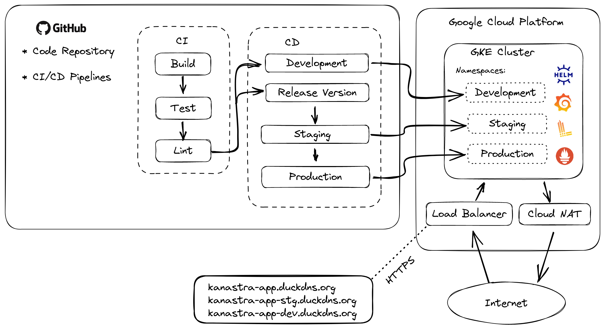
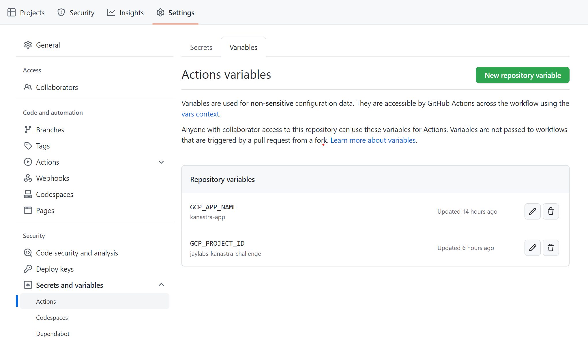
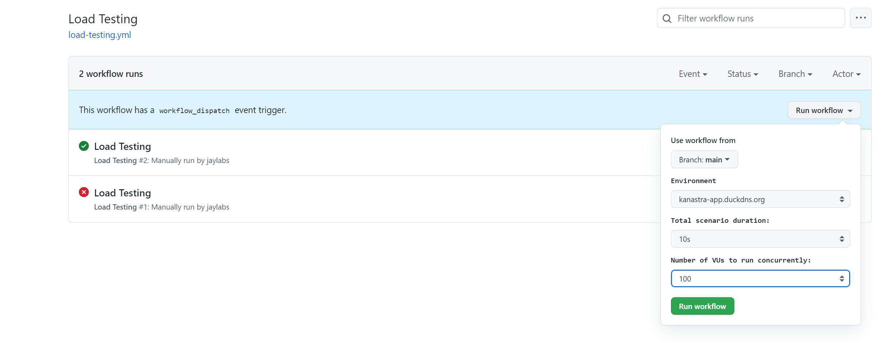

# Desafio de Código DevOps - Kanastra

- [Premissas do Desafio](#premissas-do-desafio)
  * [Provisionamento](#provisionamento)
  * [Pipelines CI/CD](#pipelines-ci-cd)
  * [Bonus](#bonus)
- [Arquitetura do Cenário](#arquitetura-do-cen-rio)
- [Configuração do Projeto](#configura--o-do-projeto)
  * [Requerimentos](#requerimentos)
  * [Setup Inicial](#setup-inicial)
  * [Provisionamento de Ambiente](#provisionamento-de-ambiente)
  * [Teardown](#teardown)
- [GitHub Actions](#github-actions)
  * [Configuração](#configura--o)
  * [Workflows](#workflows)
    + [Infrastructure CI/CD](#infrastructure-ci-cd)
    + [Application CI/CD](#application-ci-cd)
    + [Infrastructure Destroy](#infrastructure-destroy)
    + [Load Testing](#load-testing)
- [Git Flow](#git-flow)
- [Validando Ambiente](#validando-ambiente)
  * [Pull Requests](#pull-requests)
  * [Workflows](#workflows-1)
  * [Deploy](#deploy)
  * [Rollback de Deployments](#rollback-de-deployments)
  * [Lint Node.js](#lint-nodejs)
  * [Lint Terraform](#lint-terraform)
  * [K6 - Load Testing + Pod Autoscaler](#k6---load-testing---pod-autoscaler)
  * [Mocha - Test](#mocha---test)
  * [Helm - Test](#helm---test)
  * [Loki + Grafana + Prometheus](#loki---grafana---prometheus)
- [Artigos de Referência](#artigos-de-refer-ncia)


## Premissas do Desafio
### Provisionamento
* Configure um cluster k8s em núvem (EKS, AKS ou GKE) [[Código]](./infra/terraform/main.tf#L61)
* Configure a rede e suas subnets [[Código]](./infra/terraform/main.tf#L1)
* Configure a segurança usando o princípio de privilégio mínimo [[Código]](./infra/terraform/iam.tf#L4)
* Use uma IAM role para dar as permissões no cluster.
Use sempre as melhores práticas para provisionar os recursos da núvem que escolher. [[Custom Role]](./infra/terraform/iam.tf#L8) [[App Roles]](./infra/terraform/terraform.auto.tfvars#L22)


### Pipelines CI/CD
* Escolha uma ferramenta de CI/CD apropriada [[GitHub Actions]](https://github.com/jaylabs/kanastra-devops-challenge/actions)
* Configure um pipeline de build de contêiner docker da aplicação node [](https://github.com/jaylabs/kanastra-devops-challenge/actions/workflows/app-pipeline.yml)
* Configure um pipeline de deploy contínuo para o aplicação node em contêiner [](https://github.com/jaylabs/kanastra-devops-challenge/actions/workflows/app-pipeline.yml)
  * Deve conter pelo menos uma fase de testes e uma fase de deploy
    * [[Test]](.github/workflows/app-pipeline.yml#L54)
    * [[Deploy Development]](.github/workflows/app-pipeline.yml#L91)
    * [[Deploy Staging]](.github/workflows/app-pipeline.yml#L148)
    * [[Deploy Produção]](.github/workflows/app-pipeline.yml#L270)
  * A fase de deploy só deve ser executada se a fase de testes for bem-sucedida
      * [[Workflow com erros validação no Test e Lint, não avança para fase de deploy]](https://github.com/jaylabs/kanastra-devops-challenge/actions/runs/3926002309)
      * [[Workflow com falhas no staging, portanto, não executa deploy em produção. Efetuado rollback automático do staging]](https://github.com/jaylabs/kanastra-devops-challenge/actions/runs/3926462700/attempts/2)
      * [[Workflow com falhas em produção, efetuado rollback da release]](https://github.com/jaylabs/kanastra-devops-challenge/actions/runs/3926462700/attempts/4)
  * Ele deve seguir o fluxo do GitHub flow para o deploy [[Git Flow]](#git-flow)
  * O deploy deve ser feito no cluster k8s provisionado no Code Challenge [[Deploy]](#deploy)

### Bonus
* Adicionar pipelines para teste lint, e outras coisas a mais na aplicação

  * [[Lint Node.js]](.github/workflows/app-pipeline.yml#L74) [[Check]]([#lint-nodejs])
  * [[Lint Terraform]](.github/workflows/infra-pipeline.yml#L60) [[Check]]([#lint-terraform)])
  * [[K6 - Load Testing]](.github/workflows/app-pipeline.yml#L213) [[Check]]([#k6---load-testing---pod-autoscaler])
  * [[Mocha - Test]](./app/package.json#L10) [[Check]]([#mocha---test])
  * [[Helm - Test]](.github/workflows/app-pipeline.yml#L312) [[Check]]([#helm---test])
  * [[Loki + Grafana + Prometheus]](./infra/terraform/helm.tf#L35) [[Check]]([#loki---grafana---prometheus])
  * [[Rollback de Deployments]](.github/workflows/app-pipeline.yml#L338) [[Check]]([#rollback-de-deployments])
  * [[Pod Autoscaler]](./infra/helm/kanastra-app/values.yaml#L73) [[Check]]([#k6---load-testing---pod-autoscaler])
  * ~~[[Certificado SSL/TLS]](#bonus)~~ - Abortei a configuração, domínio `duckdns.org` caiu na regra de [rate limit do Let's Encrypt](https://letsencrypt.org/docs/rate-limits/) )

* O deploy de kubernetes tiver interligado com ferramenta de infra as code
  * [[Helm Install via Terraform]](./infra/terraform/helm.tf#L89) [[Check]]([#workflows-1])
  * [[Helm Upgrade via GitHub Actions]](.github/workflows/app-pipeline.yml#L270) [[Check]]([#workflows-1])


## Arquitetura do Cenário

Por ser um cenário simples e para economizar com recursos cloud, definido somente um cluster GKE para configurar os ambientes de desenvolvimento, staging e produção. Cada ambiente possui o seu respectivo namespace.

Toda infraestrutura provisionada com Terraform, podendo ser executado a partir de um workflow do GitHub Actions.

Helm gerencia o deploy da aplicação e outras ferramentas de monitoramento (Grafana, Loki, Prometheus).

A pipeline de aplicação possui etapas de validação do código e segue um fluxo para entrega contínua.



## Configuração do Projeto

### Requerimentos

Ferramentas para preparar ambiente:
- [google-cloud-sdk](https://cloud.google.com/sdk/docs/install)
- [terraform](https://learn.hashicorp.com/tutorials/terraform/install-cli)
- [git](https://github.com/git-guides/install-git)

Ferramentas para gerenciar o ambiente:
- [helm](https://helm.sh/docs/intro/install/)
- [kubectl](https://cloud.google.com/kubernetes-engine/docs/how-to/cluster-access-for-kubectl)

### Setup Inicial
Antes executar o workflow de infraestrutura, será preciso preparar o ambiente no GCP habilitando as APIs de serviços e configurando os seguintes recursos:

- Projeto para utilizar os recursos do GGP
- Bucket para armazenar o estado do Terraform
- Conta de Serviço do Terraform para configurar credencial no workflow do GitHub Actions

Efetue o login com gcloud para acessar GCP:

```
gcloud auth application-default login
```

Altere os parâmetros do ambiente no arquivo [terraform.auto.tfvars](./infra/terraform/config-init/terraform.auto.tfvars).


```
# Project config
project_id         = "jaylabs-kanastra-challenge"
project_name       = "Kanastra Challenge"
project_prefix     = "kanastra"
billing_account_id = "0X0X0X-0X0X0X-0X0X0X"
region             = "us-west1"

project_creation_enabled = false

# Terraform roles
tf_roles = [
  "roles/compute.networkAdmin",
  "roles/storage.objectAdmin",
  "roles/container.admin",
  "roles/iam.serviceAccountUser",
  "roles/iam.serviceAccountKeyAdmin",
  "roles/iam.serviceAccountAdmin",
  "roles/iam.securityAdmin",
  "roles/compute.securityAdmin"
]

# Bucket config
bucket_location = "US"
```
**Dica**: Também é possível criar o projeto com o terraform, para isso, basta mudar a variável `project_creation_enabled` para `true` e adicionar o ID da sua conta de faturamento na variável `billing_account_id`.

Para verificar qual é o ID da sua conta de faturamento, execute comando abaixo:

```
gcloud beta billing accounts list

ACCOUNT_ID            NAME                OPEN   MASTER_ACCOUNT_ID
0X0X0X-0X0X0X-0X0X0X  My Billing Account  False
0X0X0X-0X0X0X-0X0X0X  Jaylabs             True
```

Após customizar as configurações, execute os comandos terraform dentro do diretório [infra/terraform/config-init](./infra/terraform/config-init) para preparar o ambiente

```
cd ./infra/terraform/config-init

terraform init
terraform plan
terraform apply
```

Finalizando a criação dos recursos necessários para criar a infraestrutura do projeto, obtenha a chave privada da conta de serviço do Terraform.
Os dados de saída desse comando será utilizado para configurar a credencial no GitHub Actions

```
terraform output gsa_private_key_terraform
```

### Provisionamento de Ambiente

Agora você já pode criar a infraestrutura a partir da sua máquina, execute os comandos terraform no diretório [infra/terraform](./infra/terraform/config-init)

```
cd ..

terraform init
terraform plan
terraform apply
```

Se for utilizar o serviço Duck DNS, execute o comando do terraform informando o nome da variável com o token:
```
terraform apply -var duckdns_token=xxxxxxx-xxxx-xxxxx-xxx-xxxxxxxxxxxx
```

Obtenha a chave privada da conta de serviço da aplicação, o GitHub Action irá utilizar essa credencial para executar o worflow de aplicação.

```
terraform output gsa_private_key_app
```

**Dica**: Também é possível criar o ambiente todo pelo workflow do GitHub Actions

[](https://github.com/jaylabs/kanastra-devops-challenge/actions/workflows/infra-pipeline.yml)

### Teardown

Para destruir o ambiente execute o comando terraform ou workflow:

[](https://github.com/jaylabs/kanastra-devops-challenge/actions/workflows/infra-destroy.yml)


```
terraform destroy
```


## GitHub Actions

GitHub Actions é uma plataforma de integração contínua e entrega contínua (CI/CD) que permite automatizar a sua compilação, testar e pipeline de implantação. É possível criar fluxos de trabalho (workflow) que criam e testam cada pull request no seu repositório, ou implantar pull requests mesclados em produção.

### Configuração

Antes de executar os workflows será necessário configurar as variáveis e secrets do Github Actions:

- **DUCKDNS_TOKEN** - [Duck DNS](https://www.duckdns.org/) é serviço de DNS dinâmico gratuito que foi utilizado nesse projeto.
- **GCP_APP_CREDENTIALS** - Credenciais da conta de serviço da aplicação.
- **GCP_TF_CREDENTIALS** - Credenciais da conta de serviço do Terraform.


- **GCP_APP_NAME** - Nome de aplicação para efetuar pull e push de imagens docker.
- **GCP_PROJECT_ID** - Id do projeto GCP para publicar as imagens docker no GCR.



### Workflows

[](https://github.com/jaylabs/kanastra-devops-challenge/actions/workflows/infra-pipeline.yml)
[](https://github.com/jaylabs/kanastra-devops-challenge/actions/workflows/app-pipeline.yml)
[](https://github.com/jaylabs/kanastra-devops-challenge/actions/workflows/load-testing.yml)
[](https://github.com/jaylabs/kanastra-devops-challenge/actions/workflows/infra-destroy.yml)


#### Infrastructure CI/CD

Provisiona a infraestrura do zero, a pipeline possui as tarefas de validação de código, formatação, lint, plan e apply.


#### Application CI/CD

Pipeline da aplicação possui tarefas de build, teste, lint, releases, deploy e rollback.


#### Infrastructure Destroy

Esse workflow basicamente destrói a infraestrura removendo todos os recursos do GCP. Pode ser configurada para executar manualmente ou com agendamento.


#### Load Testing

Realiza testes de carga na aplicação com a ferramenta [K6](https://k6.io/docs/#what-is-k6), possibilita escolher o ambiente e os parâmetros da ferramenta.



## Git Flow

O fluxo de trabalho deste projeto foca na organização do versionamento da aplicação, utilizando 3 branches:

* **main** - branch principal do código de produção
* **staging** - branch de release para testar e validar uma nova feature ou hotfix
* **develop** - branch para os desenvolvedores testarem os seus códigos no ambiente de desenvolvimento.

A pipeline executa tarefas dependendo do tipo de evento:

* **pull request** -  Executa tarefas build test e lint.
* **push** -  Executa tarefas de build + push da imagem docker para o repositório GCR e efetua o deploy da branch develop.
* **tag** - Executa as tarefas similar ao push, mas efetua o deploy das branches staging e main.

As imagens docker possuem 2 tipos de tag:

* hash commit
* versão do app

```
gcloud container images list-tags gcr.io/jaylabs-kanastra-challenge/kanastra-app

DIGEST        TAGS                  TIMESTAMP
024251be3fdc  1.0.2,d745971,latest  2023-01-15T13:43:05
cf764b355701  1.0.1,0502bef         2023-01-15T13:33:35
7ba31337fe33  1.0.0,b22ce34         2023-01-15T13:02:20
```

Os fluxos podem ser customizados conforme a necessidade da equipe de desenvolvimento.


## Validando Ambiente

### Pull Requests

- [[PR - Checks com falha]](https://github.com/jaylabs/kanastra-devops-challenge/pull/10)
- [[PR - Checks OK]](https://github.com/jaylabs/kanastra-devops-challenge/pull/11)

### Workflows

Pipeline de aplicação:

- [[Workflow - Develop]](https://github.com/jaylabs/kanastra-devops-challenge/actions/runs/3926045324)
- [[Workflow - Staging]](https://github.com/jaylabs/kanastra-devops-challenge/actions/runs/3926068940)
- [[Workflow - Main]](https://github.com/jaylabs/kanastra-devops-challenge/actions/runs/3926078170)
- [[Workflow - Release]](https://github.com/jaylabs/kanastra-devops-challenge/actions/runs/3926088988)

Pipeline de infraestrutura:

- [[Workflow - Provisionamento]](https://github.com/jaylabs/kanastra-devops-challenge/actions/runs/3926276304/jobs/6711860130)

```
terraform apply -var "duckdns_token=$***DUCKDNS_TOKEN***" -auto-approve


Terraform used the selected providers to generate the following execution
plan. Resource actions are indicated with the following symbols:
  + create
 <= read (data resources)

Terraform will perform the following actions:

  # google_compute_address.lb will be created
  + resource "google_compute_address" "lb" ***
      + address            = (known after apply)
      + address_type       = "EXTERNAL"
      + creation_timestamp = (known after apply)
      + id                 = (known after apply)
...
...
helm_release.nginx: Creation complete after 2m42s [id=ingress-nginx]
helm_release.cert_manager: Creating...
helm_release.cert_manager: Still creating... [10s elapsed]
helm_release.cert_manager: Still creating... [20s elapsed]
helm_release.cert_manager: Still creating... [30s elapsed]
helm_release.cert_manager: Still creating... [40s elapsed]
helm_release.cert_manager: Creation complete after 44s [id=cert-manager]
kubectl_manifest.cluster_issuer: Creating...
kubectl_manifest.cluster_issuer: Creation complete after 1s [id=/apis/cert-manager.io/v1/clusterissuers/letsencrypt]

Apply complete! Resources: 39 added, 0 changed, 0 destroyed.

Outputs:

gsa_private_key_app = <sensitive>
gsa_private_key_gcr = <sensitive>
```


- [[Workflow - Teardown]](https://github.com/jaylabs/kanastra-devops-challenge/actions/runs/3926190038/jobs/6711677649)

```
Run terraform destroy -auto-approve
/home/runner/work/_temp/cd2eac45-3b10-489f-b473-11d2fe92a9ec/terraform-bin destroy -auto-approve
google_service_account.app: Refreshing state... [id=projects/jaylabs-kanastra-challenge/serviceAccounts/sa-kanastra-app@jaylabs-kanastra-challenge.iam.gserviceaccount.com]
data.google_client_config.default: Reading...
...

Destroy complete! Resources: 39 destroyed.
```

### Deploy

Gerenciamento de releases com Helm:

```
helm history kanastra-app -n production

REVISION        UPDATED                         STATUS          CHART                   APP VERSION     DESCRIPTION
1               Mon Jan 16 01:34:19 2023        superseded      kanastra-app-1.0.0      1.0.0           Install complete
2               Mon Jan 16 01:56:29 2023        superseded      kanastra-app-1.0.0      1.0.1           Upgrade complete
3               Mon Jan 16 02:03:05 2023        superseded      kanastra-app-1.0.0      1.0.2           Upgrade complete
4               Mon Jan 16 02:38:55 2023        deployed        kanastra-app-1.0.0      1.0.3           Upgrade complete
```

- [[Helm via Terraform]](https://github.com/jaylabs/kanastra-devops-challenge/actions/runs/3926276304/jobs/6711860130)

```
helm_release.app["production"]: Creating...
helm_release.app["staging"]: Creating...
helm_release.app["development"]: Creating...

helm_release.app["production"]: Still creating... [10s elapsed]
helm_release.app["staging"]: Still creating... [10s elapsed]
helm_release.app["development"]: Still creating... [10s elapsed]

helm_release.app["development"]: Creation complete after 14s [id=kanastra-app]
helm_release.app["staging"]: Creation complete after 14s [id=kanastra-app]
helm_release.app["production"]: Creation complete after 16s [id=kanastra-app]
```

- [[Helm via Workflow]](https://github.com/jaylabs/kanastra-devops-challenge/actions/runs/3926088988/jobs/6711507794)

```
Run helm upgrade kanastra-app -n production -f production-values.yaml ./kanastra-app

Release "kanastra-app" has been upgraded. Happy Helming!
NAME: kanastra-app
LAST DEPLOYED: Mon Jan 16 00:45:01 2023
NAMESPACE: production
STATUS: deployed
REVISION: 2
NOTES:
1. Get the application URL by running these commands:
  http://kanastra-app.duckdns.org/

```

### Rollback de Deployments

[Wokflow - Rollback de Produção](https://github.com/jaylabs/kanastra-devops-challenge/actions/runs/3926462700/jobs/6712540988)

```
kubectl get deployment kanastra-app -n production -o=jsonpath='***$.spec.template.spec.containers[:1].image***'
gcr.io/jaylabs-kanastra-challenge/kanastra-app:1.0.3

kubectl rollout undo deployment/kanastra-app -n production
deployment.apps/kanastra-app rolled back

kubectl get deployment kanastra-app -n production -o=jsonpath='***$.spec.template.spec.containers[:1].image***'
gcr.io/jaylabs-kanastra-challenge/kanastra-app:1.0.2

```

### Lint Node.js

- [[Workflow - Lint Node.js]](https://github.com/jaylabs/kanastra-devops-challenge/actions/runs/3926002309/jobs/6711329316)
```
> eslint app.js


/home/runner/work/kanastra-devops-challenge/kanastra-devops-challenge/app/app.js
  7:1  error  Parsing error: Unexpected token app

✖ 1 problem (1 error, 0 warnings)
```

### Lint Terraform

- [[Pull Request]](https://github.com/jaylabs/kanastra-devops-challenge/pull/14)
- [[Workflow - Lint Terraform]](https://github.com/jaylabs/kanastra-devops-challenge/actions/runs/3926136659/jobs/6711587456)

```
Run tflint -f compact
  tflint -f compact
  shell: /usr/bin/bash --noprofile --norc -e -o pipefail {0}
  env:
    TERRAFORM_CLI_PATH: /home/runner/work/_temp/3691c88f-fdb6-41f5-8e8d-dc08a150a80e
    MSYS: winsymlinks:nativestrict
1 issue(s) found:

Warning: main.tf:179:1: Warning - Missing version constraint for provider "null" in "required_providers" (terraform_required_providers)
```

### K6 - Load Testing + Pod Autoscaler

*TODO*

### Mocha - Test

- [[Workflow - Mocha Test]](https://github.com/jaylabs/kanastra-devops-challenge/actions/runs/3925965761/jobs/6711255967)

```
> mocha ./test/test.js --exit

Example app listening on port 3000!


  GET /
    1) responds with Hello World!


  0 passing (29ms)
  1 failing

  1) GET /
       responds with Hello World!:
     Error: expected 'Hello World!' response body, got 'Bye World!'
```

### Helm - Test

- [[Workflow - Helm Test]](https://github.com/jaylabs/kanastra-devops-challenge/actions/runs/3926088988/jobs/6711512610)

```
Run helm test kanastra-app -n production

NAME: kanastra-app
LAST DEPLOYED: Mon Jan 16 00:45:01 2023
NAMESPACE: production
STATUS: deployed
REVISION: 2
TEST SUITE:     kanastra-app-test-connection
Last Started:   Mon Jan 16 00:45:35 2023
Last Completed: Mon Jan 16 00:45:39 2023
Phase:          Succeeded
NOTES:
1. Get the application URL by running these commands:
  http://kanastra-app.duckdns.org/
```

### Loki + Grafana + Prometheus

## Artigos de Referência

* [Best practices for GKE networking](https://cloud.google.com/kubernetes-engine/docs/best-practices/networking)

* [Best practices for using Terraform](https://cloud.google.com/docs/terraform/best-practices-for-terraform)

* [Docker and Node.js Best Practices](https://github.com/nodejs/docker-node/blob/main/docs/BestPractices.md)

* [Building and testing Node.js](https://docs.github.com/en/actions/automating-builds-and-tests/building-and-testing-nodejs)

* [Git Flow: entenda o que é, como e quando utilizar](https://www.alura.com.br/artigos/git-flow-o-que-e-como-quando-utilizar)

* [Duck DNS - free dynamic DNS](https://www.duckdns.org/spec.jsp)

* [Validate, format, lint, secure, and test Terraform IaC - CI/CD](https://tech.aabouzaid.com/2020/04/validate-format-lint-and-test-terraform-iac-ci.html#4-lint)
