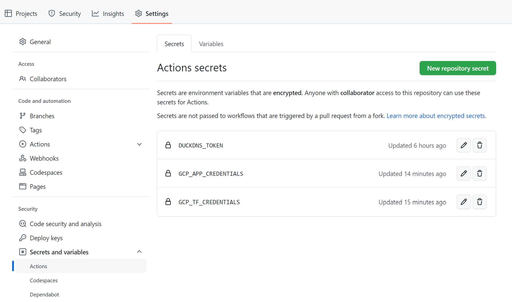
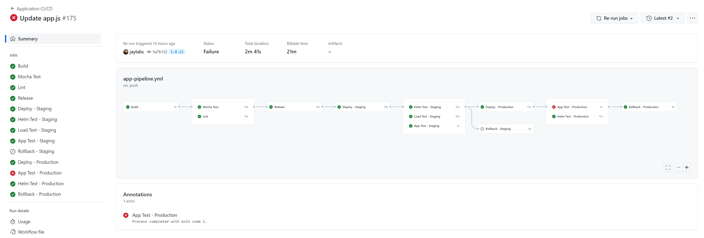

[](./README.md)
[](./README.pt-br.md)

# Desafio de Código DevOps - Kanastra

- [Premissas do Desafio](#premissas-do-desafio)
  * [Provisionamento](#provisionamento)
  * [Pipelines CI/CD](#pipelines-ci-cd)
  * [Bonus](#bonus)
- [Arquitetura do Cenário](#arquitetura-do-cen-rio)
- [Configuração do Projeto](#configura--o-do-projeto)
  * [Requerimentos](#requerimentos)
  * [Setup Inicial](#setup-inicial)
  * [Provisionamento de Ambiente](#provisionamento-de-ambiente)
  * [Teardown](#teardown)
- [GitHub Actions](#github-actions)
  * [Configuração](#configura--o)
  * [Workflows](#workflows)
    + [Application CI/CD](#application-ci-cd)
    + [Infrastructure CI/CD](#infrastructure-ci-cd)
    + [Infrastructure Destroy](#infrastructure-destroy)
    + [Load Testing](#load-testing)
- [Git Flow](#git-flow)
- [Validando Ambiente](#validando-ambiente)
  * [Pull Requests](#pull-requests)
  * [Deploy](#deploy)
  * [Rollback de Deployments](#rollback-de-deployments)
  * [Lint Node.js](#lint-nodejs)
  * [Lint Terraform](#lint-terraform)
  * [K6 - Load Testing + Pod Autoscaler](#k6---load-testing---pod-autoscaler)
  * [Mocha - Test](#mocha---test)
  * [Helm - Test](#helm---test)
  * [Loki + Grafana + Prometheus](#loki---grafana---prometheus)
  * [Certificado SSL/TLS](#certificado-ssl-tls)
- [Artigos de Referência](#artigos-de-refer-ncia)


## Premissas do Desafio
### Provisionamento
* Configure um cluster k8s em núvem (EKS, AKS ou GKE) [[Código]](./infra/terraform/main.tf#L61)
* Configure a rede e suas subnets [[Código]](./infra/terraform/main.tf#L1)
* Configure a segurança usando o princípio de privilégio mínimo [[Código]](./infra/terraform/iam.tf#L4)
* Use uma IAM role para dar as permissões no cluster.
Use sempre as melhores práticas para provisionar os recursos da núvem que escolher. [[Código]](./infra/terraform/iam.tf#L11)


### Pipelines CI/CD
* Escolha uma ferramenta de CI/CD apropriada [[GitHub Actions]](https://github.com/jaylabs/kanastra-challenge/actions)
* Configure um pipeline de build de contêiner docker da aplicação node [](https://github.com/jaylabs/kanastra-challenge/actions/workflows/app-pipeline.yml)
* Configure um pipeline de deploy contínuo para o aplicação node em contêiner [](https://github.com/jaylabs/kanastra-challenge/actions/workflows/app-pipeline.yml)
  * Deve conter pelo menos uma fase de testes e uma fase de deploy [[Test]](.github/workflows/app-pipeline.yml#L52) [[Deploy Staging]](.github/workflows/app-pipeline.yml#L112) [[Deploy Produção]](.github/workflows/app-pipeline.yml#L218)
  * A fase de deploy só deve ser executada se a fase de testes for bem-sucedida [[Código]](.github/workflows/app-pipeline.yml#L221)
  * Ele deve seguir o fluxo do GitHub flow para o deploy [[Código WIP]](.github/workflows/app-pipeline.yml#L2)
  * O deploy deve ser feito no cluster k8s provisionado no Code Challenge [[Helm Chart]](./infra/helm)

### Bonus
* Adicionar pipelines para teste lint, e outras coisas a mais na aplicação

  * [[Lint Node.js]](.github/workflows/app-pipeline.yml#L72)
  * [[Lint Terraform]](.github/workflows/infra-pipeline.yml#L60)
  * [[K6 - Load Testing]](.github/workflows/app-pipeline.yml#L170)
  * [[Mocha - Test]](./app/package.json#L10)
  * [[Helm - Test]](.github/workflows/app-pipeline.yml#L285)
  * [[Loki + Grafana + Prometheus]](./infra/terraform/helm.tf#L35)
  * [[Certificado SSL/TLS]](./infra/terraform/helm.tf#L66)
  * [[Rollback de Deployments]](.github/workflows/app-pipeline.yml#L193)
  * [[Pod Autoscaler]](./infra/helm/kanastra-app/values.yaml#L73)

* O deploy de kubernetes tiver interligado com ferramenta de infra as code
  * [[Helm Install via Terraform]](./infra/terraform/helm.tf#L89)
  * [[Helm Upgrade via GitHub Actions]](.github/workflows/app-pipeline.yml#L247)


## Arquitetura do Cenário

Xablau

## Configuração do Projeto

### Requerimentos

Ferramentas para preparar ambiente:
- [google-cloud-sdk](https://cloud.google.com/sdk/docs/install)
- [terraform](https://learn.hashicorp.com/tutorials/terraform/install-cli)
- [git](https://github.com/git-guides/install-git)

Ferramentas para gerenciar o ambiente:
- [helm](https://helm.sh/docs/intro/install/)
- [kubectl](https://cloud.google.com/kubernetes-engine/docs/how-to/cluster-access-for-kubectl)

### Setup Inicial
Antes executar o workflow de infraestrutura, será preciso preparar o ambiente no GCP habilitando as APIs de serviços e configurando os seguintes recursos:

- Projeto para utilizar os recursos do GGP
- Bucket para armazenar o estado do Terraform
- Conta de Serviço do Terraform para configurar credencial no workflow do GitHub Actions

Efetue o login com gcloud para acessar GCP:

```
gcloud auth application-default login
```

Altere os parâmetros do ambiente no arquivo [terraform.auto.tfvars](./infra/terraform/config-init/terraform.auto.tfvars).


```
# Project config
project_id         = "jaylabs-kanastra-challenge"
project_name       = "Kanastra Challenge"
project_prefix     = "kanastra"
billing_account_id = "0X0X0X-0X0X0X-0X0X0X"
region             = "us-west1"

project_creation_enabled = false

# Terraform roles
tf_roles = [
  "roles/compute.networkAdmin",
  "roles/storage.objectAdmin",
  "roles/container.admin",
  "roles/iam.serviceAccountUser",
  "roles/iam.serviceAccountKeyAdmin",
  "roles/iam.serviceAccountAdmin",
  "roles/iam.securityAdmin",
  "roles/compute.securityAdmin"
]

# Bucket config
bucket_location = "US"
```
**Dica**: Também é possível criar o projeto com o terraform, para isso, basta mudar a variável `project_creation_enabled` para `true` e adicionar o ID da sua conta de faturamento na variável `billing_account_id`.

Para verificar qual é o ID da sua conta de faturamento, execute comando abaixo:

```
gcloud beta billing accounts list

ACCOUNT_ID            NAME                OPEN   MASTER_ACCOUNT_ID
0X0X0X-0X0X0X-0X0X0X  My Billing Account  False
0X0X0X-0X0X0X-0X0X0X  Jaylabs             True
```

Após customizar as configurações, execute os comandos terraform dentro do diretório [infra/terraform/config-init](./infra/terraform/config-init) para preparar o ambiente

```
cd ./infra/terraform/config-init

terraform init
terraform plan
terraform apply
```

Finalizando a criação dos recursos necessários para criar a infraestrutura do projeto, obtenha a chave privada da conta de serviço do Terraform.
Os dados de saída desse comando será utilizado para configurar a credencial no GitHub Actions

```
terraform output gsa_private_key_terraform
```

### Provisionamento de Ambiente

Agora você já pode criar a infraestrutura a partir da sua máquina, execute os comandos terraform no diretório [infra/terraform](./infra/terraform/config-init)

```
cd ..

terraform init
terraform plan
terraform apply

terraform apply --auto-approve -var duckdns_token=78ae93a0-a692-41a5-ad82-26917d21d4f3
```

Se for utilizar o serviço Duck DNS, execute o comando do terraform informando o nome da variável com o token:
```
terraform apply -var duckdns_token=xxxxxxx-xxxx-xxxxx-xxx-xxxxxxxxxxxx
```

Obtenha a chave privada da conta de serviço da aplicação, o GitHub Action irá utilizar essa credencial para executar o worflow de aplicação.

```
terraform output gsa_private_key_app
```

**Dica**: Também é possível criar o ambiente todo pelo workflow do GitHub Actions
[](https://github.com/jaylabs/kanastra-challenge/actions/workflows/infra-pipeline.yml)

### Teardown

Para destruir o ambiente execute o comando terraform ou workflow: [](https://github.com/jaylabs/kanastra-challenge/actions/workflows/infra-destroy.yml)


```
terraform destroy
```


## GitHub Actions

GitHub Actions é uma plataforma de integração contínua e entrega contínua (CI/CD) que permite automatizar a sua compilação, testar e pipeline de implantação. É possível criar fluxos de trabalho (workflow) que criam e testam cada pull request no seu repositório, ou implantar pull requests mesclados em produção.

### Configuração

Antes de executar os workflows será necessário configurar as variáveis e secrets do Github Actions:

- **DUCKDNS_TOKEN** - [Duck DNS](https://www.duckdns.org/) é serviço de DNS dinâmico gratuito que foi utilizado nesse projeto.
- **GCP_APP_CREDENTIALS** - Credenciais da conta de serviço da aplicação.
- **GCP_TF_CREDENTIALS** - Credenciais da conta de serviço do Terraform.



- **GCP_APP_NAME** - Nome de aplicação para criar o repositório no GCR.
- **GCP_PROJECT_ID** - Id do projeto GCP para publicar a imagem docker no GCR.


### Workflows

[](https://github.com/jaylabs/kanastra-challenge/actions/workflows/infra-pipeline.yml)
[](https://github.com/jaylabs/kanastra-challenge/actions/workflows/app-pipeline.yml)
[](https://github.com/jaylabs/kanastra-challenge/actions/workflows/load-testing.yml)
[](https://github.com/jaylabs/kanastra-challenge/actions/workflows/infra-destroy.yml)


#### Infrastructure CI/CD

Provisiona a infraestrura do zero, a pipeline possui as tarefas de validação de código, formatação, lint, plan e aplicação.


#### Application CI/CD

Pipeline da aplicação possuui tarefas de build, teste, lint, cria releases, deploy em ambientes de staging/produção e rollback, caso ocorra uma falha nos testes após um deploy.



#### Infrastructure Destroy

Esse workflow basicamente destrói a infraestrura removendo todos os recursos do GCP. Pode ser configurada para executar manualmente ou com agendamento.


#### Load Testing

Realiza testes de carga na aplicação com a ferramenta [K6](https://k6.io/docs/#what-is-k6), possibilita escolher o ambiente e os parâmetros da ferramenta.


## Git Flow

O fluxo de trabalho deste projeto foca na organização do versionamento da aplicação, utilizando 3 branches:

* main - branch principal do código de produção
* staging - branch de release para testar e validar uma nova feature ou hotfix
* develop - branch para os desenvolvedores testarem o seu código no ambiente de desenvolvimento.

A pipeline executa tarefas dependendo do tipo de evento:

* pull request -  Executa tarefas build (somente o build da imagem docker), test e lint.
* push -  Executa tarefas de build (build e push da imagem docker para o repositório GCR), test e lint e deploy das branch develop.
* tag - Executa as tarefas similar ao push, mas efetua o deploy da branch staging e main.

As imagens docker possuem 2 tags:

* hash commit
* versão do app

```
gcloud container images list-tags gcr.io/jaylabs-kanastra-challenge/kanastra-app

DIGEST        TAGS                  TIMESTAMP
024251be3fdc  1.0.2,d745971,latest  2023-01-15T13:43:05
cf764b355701  1.0.1,0502bef         2023-01-15T13:33:35
7ba31337fe33  1.0.0,b22ce34         2023-01-15T13:02:20
```

Os fluxos podem ser customizados conforme a necessidade da equipe de desenvolvimento.


## Validando Ambiente

### Pull Requests
### Deploy
### Rollback de Deployments
### Lint Node.js
### Lint Terraform
### K6 - Load Testing + Pod Autoscaler
### Mocha - Test
### Helm - Test
### Loki + Grafana + Prometheus
### Certificado SSL/TLS

## Artigos de Referência

* [Building and testing Node.js](https://docs.github.com/en/actions/automating-builds-and-tests/building-and-testing-nodejs)

* [Git Flow: entenda o que é, como e quando utilizar](https://www.alura.com.br/artigos/git-flow-o-que-e-como-quando-utilizar)

* [Duck DNS - free dynamic DNS](https://www.duckdns.org/spec.jsp)

* [Validate, format, lint, secure, and test Terraform IaC - CI/CD](https://tech.aabouzaid.com/2020/04/validate-format-lint-and-test-terraform-iac-ci.html#4-lint)
